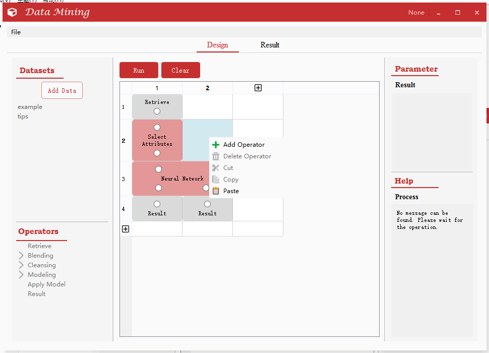
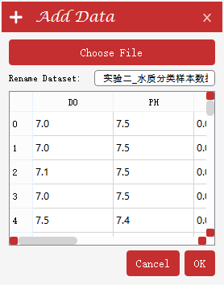
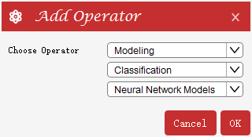
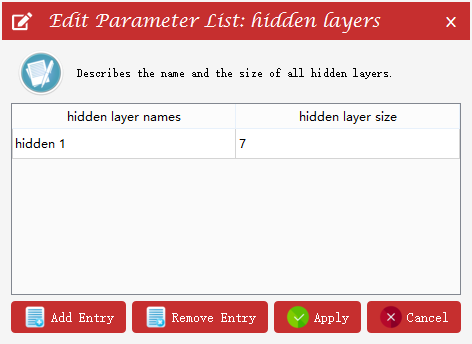
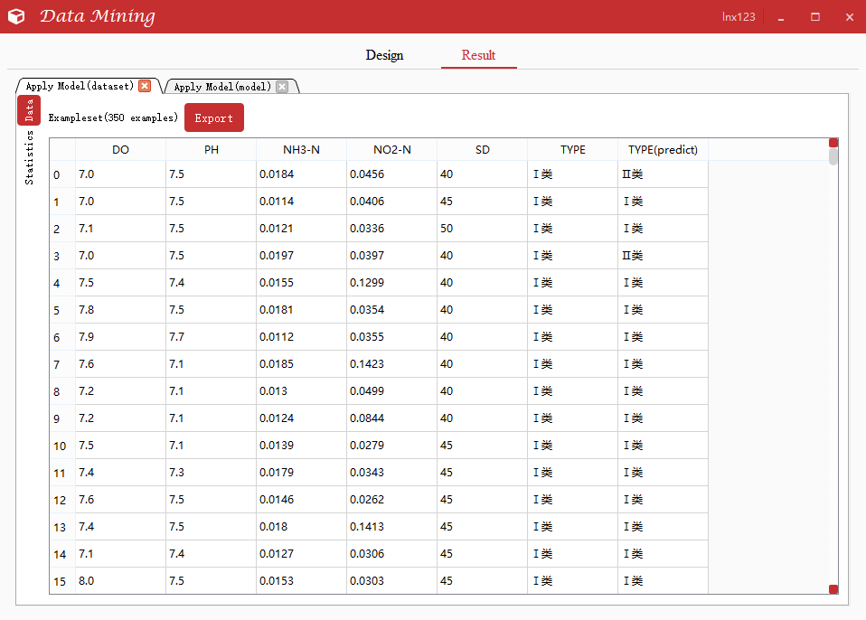
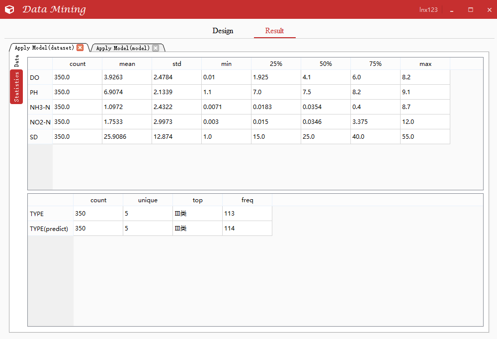
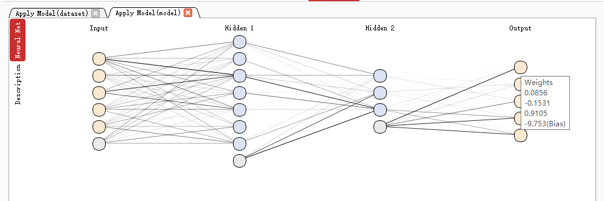
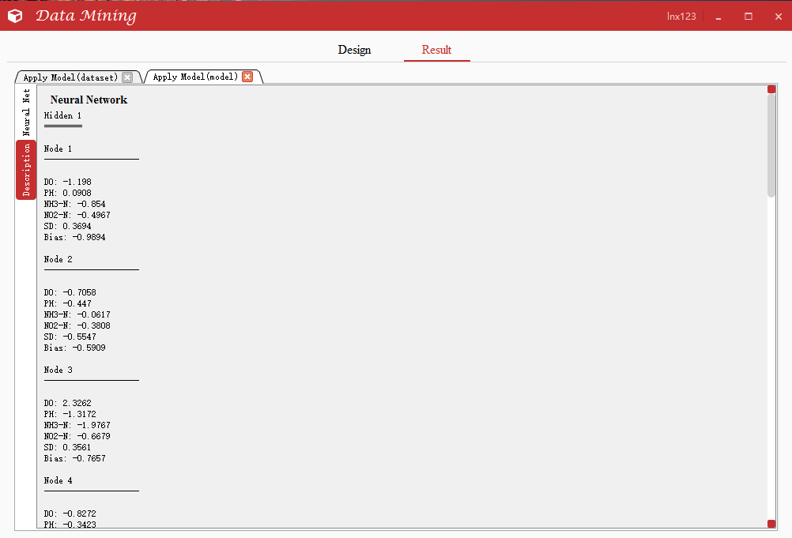

# 系统介绍

该系统主要实现五个与机器学习功能相关的模块，通过图形化界面提供若干机器学习算法的使用方式，并能够展示算法的结果。系统主要涉及数据预处理（常规处理如缺失值、标准化处理等，还有主成分分析）、K-means聚类、BP神经网络、ID3决策树、指数平滑。

注：许多功能还未完善，如保存设计好的项目，目前只能保存操作符，无法保存具体的参数，且保存的格式暂时是随意设置的。

如果在命令行中启动，则需先进入/DataMining/Logic/目录下，再运行logic_control.py文件
建议使用Pycharm，在IDE中运行

程序界面介绍
--------
### Design标签页

datasets区：可添加数据，在数据集上右键菜单可查看与删除数据集

operators区：点击具体项可在help区查看帮助信息
process区：单元格右键菜单可添加、删除、剪切、复制、粘贴操作符；点击已添加的操作符可在parameter区设置参数；run按钮运行运算程序；clear清空程序设计界面；可添加行或列

parameter区：设置参数

help区：查看帮助

用户可自行调整各区域大小

### Result标签页

查看数据集

查看数据的描述性统计（点击左侧的红色“Statistics”标签后显示）

查看模型结果（图为神经网络，其中连线深浅反映权重大小，光标停留在某个神经元时，会出现label，显示权重的具体值）

直接查看所有节点的权重值

还有其他算法的结果这里不展示了。

--------------------------------
## 项目结构介绍

DataMining/
    dataset：存放数据集
    font：存放字体图标
    icon：存放图标
    process：存放运算程序（不保存操作符的参数设置）
    qss：类似css，界面美化
    temp：存放临时文件，如决策树生成的图
    GUI/
        addDataDialog.py：添加数据对话框的界面设计
        addOperatorDialog.py：添加操作符对话框的界面设计
        editClassDialog.py：编辑类别对话框的界面设计
        loginDialog.py：登录对话框的界面设计
        mainwindow_nologic.py：主窗口的界面设计
        operatorWidget.py：操作符图形设计以及其对应的核心程序
        selectAttributeDialog.py：选择属性对话框的界面设计
        titleBar.py：自定义标题栏与自定义对话框
    Logic/
        databaseOperation.py：封装数据库操作
        help_message.json：存放帮助信息
        logic_control.py：程序逻辑，操纵界面
        pandasModel.py：自定义pandas的Dataframe在qyqt中的表格形式展示